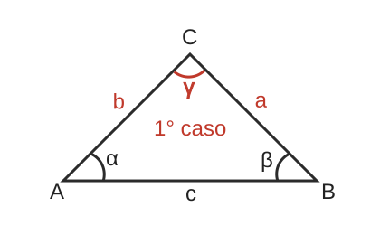
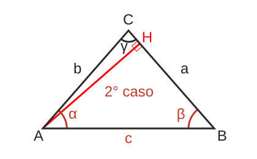
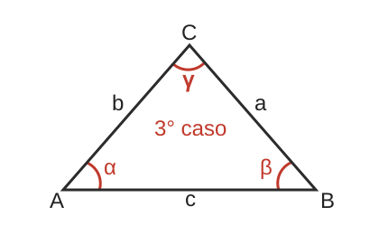

# Triangoli

Trovare area, perimetro, lati e angoli sconosciuti

## Caso 1 - Noti un lato e i due angoli adiacenti

### Trovare l'angolo $\gamma$

In ogni triangolo la somma dei 3 lati è di 180° quindi

$$
\large
\gamma = 180° - \alpha - \beta
$$

### Trovare i lati $a$ e $b$

[Teorema dei seni o di Eulero](https://it.wikipedia.org/wiki/Teorema_dei_seni): esprime una relazione di proporzionalità diretta fra le lunghezze dei lati di un triangolo e i seni dei rispettivi angoli opposti

$$
\large
\frac{a}{sin(\alpha)} = \frac{b}{sin(\beta)} = \frac{c}{sin(\gamma)}
$$

Pertanto i lati $a$ e $b$ possono essere calcolati

$$
\large
a = \frac{c \cdot sin(\alpha)}{sin(\gamma)}
$$

$$
\large
b = \frac{c \cdot sin(\beta)}{sin(\gamma)}
$$

### Perimetro

$P = a + b +c$

### Area

[Formula di Erone](https://it.wikipedia.org/wiki/Formula_di_Erone): afferma che l'area di un triangolo i cui lati abbiano lunghezze $a$, $b$, $c$ è data da:

$$
\large
A = \sqrt{p\ \cdot (p - a) \cdot (p - b) \cdot (p - c)}
$$

dove $p$ è il semiperimetro

$$
\large
p = \frac{a + b + c}{2}
$$

## Caso 2 - Noti i lati $a$, $b$ e l'angolo $\gamma$

Altezza $\overline{AH}$ tracciata da A verso il lato $\overline{BC}$

### Area

Formula:
$$
\large
Area = \frac{1}{2} \cdot base \cdot altezza
$$

Scegliendo base $\overline{BC}$ e altezza $\overline{AH}$

$$
\large
Area = \frac{1}{2} \cdot \overline{AH} \cdot \overline{BC}
$$

Triangolo rettangolo ACH

$$
\large
\overline{AH} = b \cdot sin(\gamma)
$$

Area è data dal semiprodotto delle misure di due lati moltiplicato per il seno dell'angolo compreso.

Formula:

$$
\large
Area = \frac{1}{2} \cdot a \cdot b \cdot sin(\gamma)
$$

### ......

$$
\large
\overline{HC} = b\ cos(\gamma)
$$

$$
\large
\overline{HA} = b\ sin(\gamma)
$$

$$
\large
\overline{HB} = a - b \cdot cos(\gamma)
$$

$$
\large
\overline{AB} = \sqrt{\overline{HB}^2 + \overline{HA}^2}
$$

$$
\large
\overline{AB} = \sqrt{(a - b \cdot cos(\gamma))^2 + b^2 sin^2 \gamma}
$$

$$
\large
\overline{AB} = \sqrt{a^2 + b^2 cos^2\gamma - 2ab\ cos\gamma + b^2 sin^2\gamma}
$$

$$
\large
\overline{AB} = \sqrt{a^2+b^2-2ab\ cos \gamma}
$$

$$
\large
cos \beta = \frac{\overline{HB}}{\overline{AB}}
$$

## Caso 3 - Noti i tre lati

### Trovare gli angoli $\alpha$, $\beta$ e $\gamma$

[Teorema del coseno](https://it.wikipedia.org/wiki/Teorema_del_coseno): esprime la relazione tra la lunghezza dei lati di un triangolo e il coseno di uno dei suoi angoli. Può essere considerato una generalizzazione del teorema di Pitagora al caso di triangoli non rettangoli.

$$
\large
c^2 = a^2 + b^2 - 2ab\ cos(\gamma)
$$

$$
\large
2ab\ cos(\gamma) = a^2 + b^2 - c^2
$$

$$
\large
cos(\gamma) = \frac{a^2+b^2-c^2}{2ab}
$$

$$
\large
\gamma = arccos(valore)
$$

### Angoli

$$
\large
\gamma = arccos(\frac{a^2 + b^2 - c^2}{2ab})
$$

$$
\large
\alpha = arccos(\frac{b^2+c^2-a^2}{2bc})
$$

$$
\large
\beta = arccos(\frac{a^2+c^2-b^2}{2ac})
$$

### Perimetro

$$
\large
P = a+b+c
$$

### Area

[Formula di Erone](https://it.wikipedia.org/wiki/Formula_di_Erone): afferma che l'area di un triangolo i cui lati abbiano lunghezze $a$, $b$, $c$ è data da:

$$
\large
A = \sqrt{p\ \cdot (p - a) \cdot (p - b) \cdot (p - c)}
$$

dove $p$ è il semiperimetro

$$
\large
p = \frac{a + b + c}{2}
$$
